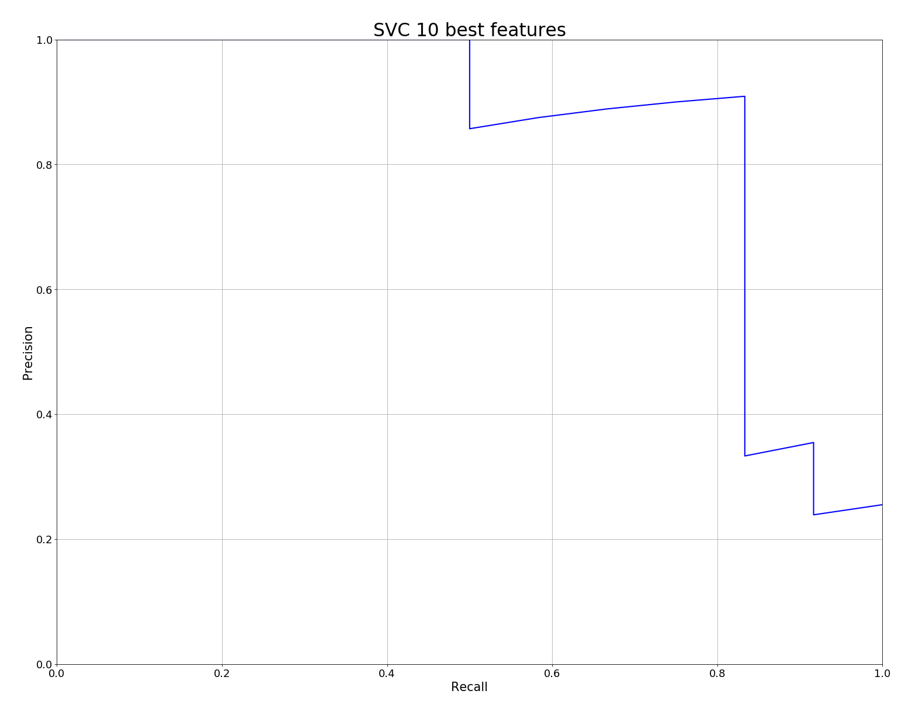
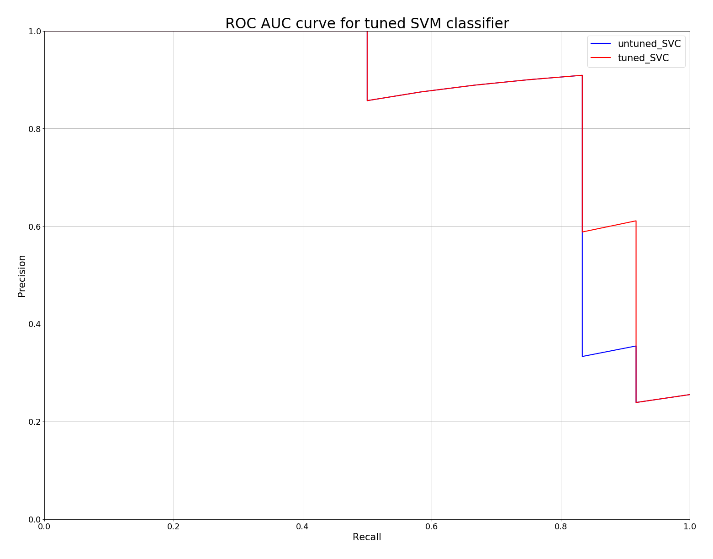

# ENRON fraud detection

Identify persons of interest (POIs) from ENRON financial and email data (educational purpose) 


## 1. Project goal

This project is about using machine learning (ML) to identify Persons of Interest (POI) involved in the Enron scandal which surfaced end of 2001. By systematic usage of accounting loopholes and poor financial reporting, involved executives and employees were able to hide billions of dollars from failed deals and projects. As a result Enron went bankrupt and many people and share holder lost their money and pensions. Machine learning (binary classification) is used to identify POIs by financial and email data. Supervised ML is particularly useful in this area as it can identify patterns in data automatically and relate them to a given class (poi/ non-poi). In contrast, conservative coding would require extreme complex rules and algorithms for this classification task.    

#### The dataset

The present dataset is taken from the [*Enron Email Dataset*]( https://www.cs.cmu.edu/~./enron/) and comprises financial and email data. There are 146 data points (employees and executives from Enron). 18 people are identified as POI and 128 as non-POI. There are 20 features in the dataset. 10 of them are payment features, 4 are stock features (14 financial features) and there are 6 email features. From the output below you can see that all features show missing data. *loan_advances* does only have only 4 *non-null* values and *director_fees*, *restricted_stock_deferred* only 17, respectively 18 *non-null* values. 

```python
data_Frame.info()
<class 'pandas.core.frame.DataFrame'>
Index: 146 entries, ALLEN PHILLIP K to YEAP SOON
Data columns (total 21 columns):
poi                          146 non-null int64
salary                       95 non-null float64
bonus                        82 non-null float64
long_term_incentive          66 non-null float64
deferred_income              49 non-null float64
deferral_payments            39 non-null float64
loan_advances                4 non-null float64
other                        93 non-null float64
expenses                     95 non-null float64
director_fees                17 non-null float64
total_payments               125 non-null float64
exercised_stock_options      102 non-null float64
restricted_stock             110 non-null float64
restricted_stock_deferred    18 non-null float64
total_stock_value            126 non-null float64
email_address                111 non-null object
to_messages                  86 non-null float64
from_messages                86 non-null float64
from_this_person_to_poi      86 non-null float64
from_poi_to_this_person      86 non-null float64
shared_receipt_with_poi      86 non-null float64
dtypes: float64(19), int64(1), object(1)
memory usage: 25.1+ KB
```

#### Outliers detection

In order to take a closer look to the dataset I created a [histogram plot](./images/features_histogram_plots.png) for all features. Almost all features show extreme outliers. Checking the *bonus* feature for values above 10M USD reveals a data point called *TOTAL*, which is the sum of each column (feature). I delete *TOTAL* from the dataset. 

By cross checking the list of names in the dataset I found a data point named *THE TRAVEL AGENCY IN THE PARK*. I remove it as well as the data is not related to a specific person and it only contains two features (*other*, *total_payments*). The feature *total_payments* is the sum of all payment features (*salary*, *bonus*, *long_term_incentive*, *deferred_income*, *deferral_payments*, *other*, *expenses*, *director_fees*) and *total_stock_value* is the sum of stock features (*exercised_stock_options*, *restricted_stock*, *restricted_stock_deferred*). Comparing the sum of these features to the total values reveals a mismatch for the two instances *BHATNAGAR SANJAY* and *BELFER ROBERT*. The values weren't imported correctly from the [original financial feature list](./data/enron61702insiderpay.pdf). The corrected data can be seen in the table below. 

|          Feature          | BELFER ROBERT | BHATNAGAR SANJAY |
| :-----------------------: | ------------: | ---------------: |
|          salary           |           NaN |              NaN |
|           bonus           |           NaN |              NaN |
|    long_term_incentive    |           NaN |              NaN |
|      deferred_income      |     -102500.0 |              NaN |
|     deferral_payments     |           NaN |              NaN |
|       loan_advances       |           NaN |              NaN |
|           other           |           NaN |              NaN |
|         expenses          |        3285.0 |         137864.0 |
|       director_fees       |      102500.0 |              NaN |
|      total_payments       |        3285.0 |         137864.0 |
|  exercised_stock_options  |           NaN |       15456290.0 |
|     restricted_stock      |       44093.0 |        2604490.0 |
| restricted_stock_deferred |      -44093.0 |       -2604490.0 |
|     total_stock_value     |           NaN |       15456290.0 |

At last I check the email features. The instance *KAMINSKI WINCENTY J* shows unreasonable value for the feature *from_messages*. I actually do not believe this guy send more than 14k emails and only received 4.6k.   I use median mail values for *Kaminski* as the current values are not trustworthy to me. The result can be seen in the table below.   

|           Mail features | KAMINSKI WINCENTY J (before) | KAMINSKI WINCENTY J (after) |
| ----------------------: | ---------------------------: | --------------------------- |
|             to_messages |                       4607.0 | 1211.0                      |
|           from_messages |                      14368.0 | 41.0                        |
| from_this_person_to_poi |                        171.0 | 8.0                         |
| from_poi_to_this_person |                         41.0 | 35.0                        |
| shared_receipt_with_poi |                        583.0 | 740.5                       |

The image below shows the histogram plots of all corrected features. In addition I created [box plots](./images/features_box_plots_corrected.png) for all features to assess basic statistics (mean values, standard dev., ...) quickly. 


It is obvious that there are still many outliers in the dataset. As extreme values might be an indication for fraud or any other irregular operation I'll keep the remaining data as is.


## 2. Feature selection

There are 20 features provided with the current dataset. The feature *email_address* does not seem to be a good indicator whether a person is a POI or not. I drop this feature. As we've seen above *loan_advances* is available for four instances only. This seems to me too few information, so I drop it as well. 

#### New features

Before starting with the selection process to find the best features for a chosen algorithm I like to incorporate a few new features. The features *to_messages* and *from_messages* are the number of mails a person received (*to*) and sent (*from*) from/ to others. The sheer number of e-mails cannot be an indicator of fraud. But maybe the ratio of mails sent to a poi divided by the number of sent messages. Therefore I created two new features, the *toPOI_rate* and *fromPOI_rate*.

In order to create further new features I divide each feature by all other features and calculate the pearson correlation coefficient with the *poi* column. The best correlations can be seen in the table below. 

```
                    feature              divisor      corr  count
0                     bonus    deferral_payments  0.665900     21
1   from_this_person_to_poi    deferral_payments  0.650054     22
2   shared_receipt_with_poi    deferral_payments  0.551253     22
3          restricted_stock    deferral_payments  0.516681     26
4   exercised_stock_options    deferral_payments  0.493101     32
5   from_poi_to_this_person    deferral_payments  0.471403     22
6         total_stock_value    deferral_payments  0.447212     36
7            total_payments    deferral_payments  0.441996     37
9   exercised_stock_options        from_messages  0.373662     67
11                 expenses    deferral_payments  0.356435     22
13  from_this_person_to_poi        from_messages  0.336790     86
14              to_messages    deferral_payments  0.336584     22
15      long_term_incentive       total_payments  0.326070     65
17                   salary    deferral_payments  0.304583     26
18        total_stock_value        from_messages  0.301027     81
19                    bonus       total_payments  0.297819     81
20                    bonus        from_messages  0.297435     61
23  exercised_stock_options       total_payments  0.274168     85
24          deferred_income  long_term_incentive  0.271228     23
25  shared_receipt_with_poi          to_messages  0.260937     86
```

Based on this data I created new features as can be seen in the table below. This is actually just an experiment. I want to see how these auto-features work.  

| New feature                                 | Numerator                 | Denominator         |
| ------------------------------------------- | ------------------------- | ------------------- |
| *bonus_deferral_payments_rate*              | *bonus*                   | *deferral_payments* |
| *rest_stock_deferral_payments_rate*         | *restricted_stock*        | *deferral_payments* |
| *exer_stock_options_deferral_payments_rate* | *exercised_stock_options* | *deferral_payments* |
| *long_term_incentive_total_payments_rate*   | *long_term_incentive*     | *total_payments*    |
| *bonus_total_payments_rate*                 | *bonus*                   | *total_payments*    |
| *exer_stock_options_total_payments_rate*    | *exercised_stock_options* | *total_payments*    |

#### Imputation and feature scaling

As we've seen above there is a lot of missing data in our dataset. During the course of this project I checked different imputation strategies. For the finally selected POI identifier I decided to fill the financial features with 0.0. For the email features I use the median for all missing values. The same strategy is applied to the newly created features. For *toPOI_rate* and *fromPOI_rate* I use the median and for the extra financial features I use 0.0. This is imputation strategy 4 (*impute_04*) from the *poi_id.py* script.    

The final AI model is a Support Vector Classifier. Support Vector Machines are sensitive to feature scales, so the final features are scaled using a Power Transformer applying the *yeo-johnson* method. I also used the Standard Scaler and the Robust Scaler but the algorithm works best with the Power Transformer. This might be caused by the many outliers still in our dataset.

#### Selection of features

For feature selection I used the SelectKBest and recursive feature elimination (RFE) method. For the latter I used a linear SVM classifier as estimator. The scores and ranking of both methods can be found in the following two tables.  

***Ranking of features by RFE method***

| Rank | Feature                                   |
| :--: | ----------------------------------------- |
|  1   | expenses                                  |
|  2   | total_stock_value                         |
|  3   | exercised_stock_options                   |
|  4   | toPOI_rate                                |
|  5   | bonus                                     |
|  6   | exer_stock_options_deferral_payments_rate |
|  7   | rest_stock_deferral_payments_rate         |
|  8   | bonus_deferral_payments_rate              |
|  9   | deferred_income                           |
|  10  | shared_receipt_with_poi                   |
|  11  | salary                                    |
|  12  | exer_stock_options_total_payments_rate    |
|  13  | other                                     |
|  14  | deferral_payments                         |
|  15  | long_term_incentive_total_payments_rate   |
|  16  | restricted_stock_deferred                 |
|  17  | long_term_incentive                       |
|  18  | bonus_total_payments_rate                 |
|  19  | from_this_person_to_poi                   |
|  20  | total_payments                            |
|  21  | restricted_stock                          |
|  22  | from_poi_to_this_person                   |
|  23  | fromPOI_rate                              |
|  24  | director_fees                             |

**Scores based of SelectKBest algorithm**

| Rank | Feature                                   | Score     |
| :--: | :---------------------------------------- | :-------- |
|  1   | toPOI_rate                                | 16.262856 |
|  2   | total_stock_value                         | 14.241934 |
|  3   | bonus_total_payments_rate                 | 11.526630 |
|  4   | expenses                                  | 10.429717 |
|  5   | bonus                                     | 10.375911 |
|  6   | other                                     | 10.141966 |
|  7   | long_term_incentive                       | 8.855082  |
|  8   | total_payments                            | 8.432336  |
|  9   | restricted_stock                          | 7.226538  |
|  10  | salary                                    | 7.109366  |
|  11  | long_term_incentive_total_payments_rate   | 6.686345  |
|  12  | shared_receipt_with_poi                   | 6.653376  |
|  13  | from_this_person_to_poi                   | 5.487458  |
|  14  | from_poi_to_this_person                   | 3.831456  |
|  15  | deferred_income                           | 3.631673  |
|  16  | restricted_stock_deferred                 | 2.038400  |
|  17  | exer_stock_options_total_payments_rate    | 1.750332  |
|  18  | director_fees                             | 1.680000  |
|  19  | exercised_stock_options                   | 1.492036  |
|  20  | fromPOI_rate                              | 0.553620  |
|  21  | exer_stock_options_deferral_payments_rate | 0.227228  |
|  22  | deferral_payments                         | 0.040150  |
|  23  | bonus_deferral_payments_rate              | 0.024962  |
|  24  | rest_stock_deferral_payments_rate         | 0.001848  |

In order to select the best features I iterated over both ranked feature lists and performed a cross validation altering the number of best features (1, 2, 3 , .... best features) for each loop. The ROC AUC scores of this process is given below for the RFE feature selection method. Best ROC AUC score (0.944) we get for the 10 best features. Using more features reduces the performance of the model. 

| Number of best RFE features | ROC AUC Score          |
| --------------------------- | ---------------------- |
| 1                           | 0.33333333333333337    |
| 2                           | 0.6846590909090908     |
| 3                           | 0.7954545454545454     |
| 4                           | 0.9375000000000001     |
| 5                           | 0.9214015151515151     |
| 6                           | 0.9289772727272727     |
| 78                          | 0.928030303030303      |
| 8                           | 0.9346590909090909     |
| 9                           | 0.9261363636363636     |
| **10**                      | **0.9441287878787878** |
| 11                          | 0.9261363636363636     |
| 12                          | 0.9214015151515151     |
| 13                          | 0.918560606060606      |
| 14                          | 0.9109848484848484     |
| 15                          | 0.9185606060606061     |
| 16                          | 0.9109848484848484     |
| 17                          | 0.9119318181818181     |
| 18                          | 0.9138257575757576     |
| 19                          | 0.9043560606060606     |
| 20                          | 0.8996212121212122     |
| 21                          | 0.8778409090909092     |
| 22                          | 0.8740530303030303     |
| 23                          | 0.8740530303030303     |
| 24                          | 0.8740530303030303     |

The selected features are *expenses, total_stock_value, exercised_stock_options, toPOI_rate, bonus, exer_stock_options_deferral_payments_rate, rest_stock_deferral_payments_rate, bonus_deferral_payments_rate, deferred_income* and *shared_receipt_with_poi*. It is interesting that 4 out of the 10 features are newly created features.

In addition I plotted the precision vs recall curve for the selected 10 best features using a linear SVM classifier (cross validated results) using the training set.



## 3. Model selection and tuning

I choose two different algorithms, a Support Vector Classifier (SVC) and a Stochastic Gradient Descent Classifier (SGD). In order to tune the algorithm I use a cross validated randomized search algorithm (RandomizedSearchCV) with 5000 iterations to find the best hyper parameters. 

Tuning the model's parameters helps optimizing the algorithm to perform better. We use the training data to optimize these parameters. Optimization to the training data may lead to over-fitting, so that the resulting model might not generalize well on the test set or in real life operation. In order to minimize over-fitting I use a cross validation approach to tune the parameters of the model.     

#### Support Vector Machine    

The following parameters are tuned:

```python
`param_distributions = {`
            `'kernel': ['linear', 'rbf'],`
            `'C': stats.uniform(0.1, 10000),`
            `'gamma': stats.expon(scale=1.0),`
        }`
```

I try a linear and *RBF* kernel. The regulation parameter C is randomly chosen between 0.1 and 10000. The last parameter is gamma for witch I use a exponential distribution function. The precision vs recall curves for the tuned and untuned model can be seen in the image below.



#### Stochastic Gradient Descent

 