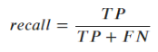

# ENRON fraud detection

Identify persons of interest (POI) from ENRON financial and email data (educational purpose) 


## 1. Project goal

This project is about using machine learning (ML) to identify Persons of Interest (POI) involved in the Enron scandal which surfaced end of 2001. By systematic usage of accounting loopholes and poor financial reporting, involved executives and employees were able to hide billions of dollars from failed deals and projects. As a result Enron went bankrupt and many people and share holder lost their money and pensions. Machine learning (binary classification) is used to identify POIs by financial and email data. Supervised ML is particularly useful in this area as it can identify patterns in data automatically and relate them to a given class (poi/ non-poi). In contrast, conservative coding would require extreme complex rules and algorithms for this classification task.    

#### The dataset

The present dataset is taken from the [*Enron Email Dataset*](https://www.cs.cmu.edu/~./enron/) and comprises financial and email data. There are 146 data points (employees and executives from Enron). 18 people are identified as POI and 128 as non-POI. There are 20 features in the dataset. 10 of them are payment features, 4 are stock features (14 financial features) and there are 6 email features. From the output below you can see that all features show missing data. *loan_advances* does only show 4 *non-null* values and *director_fees* and  *restricted_stock_deferred* only 17 and 18 *non-null* values. 

```python
data_Frame.info()
<class 'pandas.core.frame.DataFrame'>
Index: 146 entries, ALLEN PHILLIP K to YEAP SOON
Data columns (total 21 columns):
poi                          146 non-null int64
salary                       95 non-null float64
bonus                        82 non-null float64
long_term_incentive          66 non-null float64
deferred_income              49 non-null float64
deferral_payments            39 non-null float64
loan_advances                4 non-null float64
other                        93 non-null float64
expenses                     95 non-null float64
director_fees                17 non-null float64
total_payments               125 non-null float64
exercised_stock_options      102 non-null float64
restricted_stock             110 non-null float64
restricted_stock_deferred    18 non-null float64
total_stock_value            126 non-null float64
email_address                111 non-null object
to_messages                  86 non-null float64
from_messages                86 non-null float64
from_this_person_to_poi      86 non-null float64
from_poi_to_this_person      86 non-null float64
shared_receipt_with_poi      86 non-null float64
dtypes: float64(19), int64(1), object(1)
memory usage: 25.1+ KB
```

#### Outliers detection

In order to take a closer look to the dataset I created a [histogram plot](./images/features_histogram_plots.png) for all features. Almost all features show extreme outliers. Checking the *bonus* feature for values above 10M USD reveals a data point called *TOTAL*, which is the sum of each column (feature). I delete *TOTAL* from the dataset. 

By cross checking the list of names in the dataset I found a data point named *THE TRAVEL AGENCY IN THE PARK*. I remove it as well as the data is not related to a specific person and it only contains two features (*other*, *total_payments*). The feature *total_payments* is the sum of all payment features (*salary*, *bonus*, *long_term_incentive*, *deferred_income*, *deferral_payments*, *other*, *expenses*, *director_fees*) and *total_stock_value* is the sum of stock features (*exercised_stock_options*, *restricted_stock*, *restricted_stock_deferred*). Comparing the sum of these features to the total values reveals a mismatch for the two instances *BHATNAGAR SANJAY* and *BELFER ROBERT*. The values weren't imported correctly from the [original financial feature list](./data/enron61702insiderpay.pdf). The corrected data can be seen in the table below. 

|          Feature          | BELFER ROBERT | BHATNAGAR SANJAY |
| :-----------------------: | ------------: | ---------------: |
|          salary           |           NaN |              NaN |
|           bonus           |           NaN |              NaN |
|    long_term_incentive    |           NaN |              NaN |
|      deferred_income      |     -102500.0 |              NaN |
|     deferral_payments     |           NaN |              NaN |
|       loan_advances       |           NaN |              NaN |
|           other           |           NaN |              NaN |
|         expenses          |        3285.0 |         137864.0 |
|       director_fees       |      102500.0 |              NaN |
|      total_payments       |        3285.0 |         137864.0 |
|  exercised_stock_options  |           NaN |       15456290.0 |
|     restricted_stock      |       44093.0 |        2604490.0 |
| restricted_stock_deferred |      -44093.0 |       -2604490.0 |
|     total_stock_value     |           NaN |       15456290.0 |

At last I check the email features. The instance *KAMINSKI WINCENTY J* shows unreasonable value for the feature *from_messages*. I actually do not believe this guy send more than 14k emails and only received 4.6k.   I use median mail values for *Kaminski* as the current values are not trustworthy to me. The result can be seen in the table below.   

|           Mail features | KAMINSKI WINCENTY J (before) | KAMINSKI WINCENTY J (after) |
| ----------------------: | ---------------------------: | --------------------------- |
|             to_messages |                       4607.0 | 1211.0                      |
|           from_messages |                      14368.0 | 41.0                        |
| from_this_person_to_poi |                        171.0 | 8.0                         |
| from_poi_to_this_person |                         41.0 | 35.0                        |
| shared_receipt_with_poi |                        583.0 | 740.5                       |

The image below shows the histogram plots of all corrected features. In addition I created [box plots](./images/features_box_plots_corrected.png) for all features to assess basic statistics (mean values, standard dev., ...) quickly. 


It is obvious that there are still many outliers in the dataset. As extreme values might be an indication for fraud or any other irregular operation I'll keep the remaining data as is.


## 2. Feature selection

There are 20 features provided with the current dataset. The feature *email_address* does not seem to be a good indicator whether a person is a POI or not. I drop this feature. As we've seen above *loan_advances* is available for four instances only. This seems to me too few information, so I drop it as well. 

#### New features

Before starting with the selection process to find the best features for a chosen algorithm I like to incorporate a few new features. The features *to_messages* and *from_messages* are the number of mails a person received (*to*) and sent (*from*) from/ to others. The sheer number of e-mails cannot be an indicator of fraud. But maybe the ratio of mails sent to a poi divided by the number of sent messages. Therefore I created two new features, the *toPOI_rate* and *fromPOI_rate*.

In order to create further new features I divide each feature by all other features and calculate the pearson correlation coefficient with the *poi* column. The best correlations can be seen in the table below. 

```
                  numerator          denominator      corr  count_instances
0                     bonus    deferral_payments  0.665900     21
1   from_this_person_to_poi    deferral_payments  0.650054     22
2   shared_receipt_with_poi    deferral_payments  0.551253     22
3          restricted_stock    deferral_payments  0.516681     26
4   exercised_stock_options    deferral_payments  0.493101     32
5   from_poi_to_this_person    deferral_payments  0.471403     22
6         total_stock_value    deferral_payments  0.447212     36
7            total_payments    deferral_payments  0.441996     37
9   exercised_stock_options        from_messages  0.373662     67
11                 expenses    deferral_payments  0.356435     22
13  from_this_person_to_poi        from_messages  0.336790     86
14              to_messages    deferral_payments  0.336584     22
15      long_term_incentive       total_payments  0.326070     65
17                   salary    deferral_payments  0.304583     26
18        total_stock_value        from_messages  0.301027     81
19                    bonus       total_payments  0.297819     81
20                    bonus        from_messages  0.297435     61
23  exercised_stock_options       total_payments  0.274168     85
24          deferred_income  long_term_incentive  0.271228     23
25  shared_receipt_with_poi          to_messages  0.260937     86
```

Based on this data I create new features as can be seen in the table below. This is actually just an experiment. I want to see how these auto-created features work.  

| New feature                                 | Numerator                 | Denominator         |
| ------------------------------------------- | ------------------------- | ------------------- |
| *bonus_deferral_payments_rate*              | *bonus*                   | *deferral_payments* |
| *rest_stock_deferral_payments_rate*         | *restricted_stock*        | *deferral_payments* |
| *exer_stock_options_deferral_payments_rate* | *exercised_stock_options* | *deferral_payments* |
| *long_term_incentive_total_payments_rate*   | *long_term_incentive*     | *total_payments*    |
| *bonus_total_payments_rate*                 | *bonus*                   | *total_payments*    |
| *exer_stock_options_total_payments_rate*    | *exercised_stock_options* | *total_payments*    |

#### Imputation and feature scaling

As we've seen above there is a lot of missing data in our dataset. During the course of this project I checked different imputation strategies. For the finally selected POI identifier I decided to fill the financial features with 0.0. For the email features I use the median for all missing values. The same strategy is applied to the newly created features. For *toPOI_rate* and *fromPOI_rate* I use the median and for the extra financial features I use 0.0. This is imputation strategy 4 (*impute_04*) from the *poi_id.py* script.    

The investigated AI models are a Support Vector Classifier and a Stochastic Gradient Descent classifier. Both models are sensitive to feature scales, so the final features are scaled using a Power Transformer applying the *yeo-johnson* method. I also used the Standard Scaler and the Robust Scaler but the algorithms work best with the Power Transformer. This might be caused by the many outliers still in our dataset.

#### Selection of features

Before we start investigating what features work best I split the data into a training and test set. The dataset is quite small and we only have 18 instances labeled as POI. Generally I would chose a test set size of about 20% up to 30% of the whole data. In our case we would end up with less than 6 POIs in the test set. As I want to use the test set to validate the performance of our classifiers I decided to create a much bigger test set of 50%, knowing that this could compromise/ reduce the performance of our AI models.  

For feature selection I use cross validated recursive feature elimination (RFECV) method. An estimator is required to run RFECV method, so we will come up with different sets of features for each investigated classifier. RFECV provides feature rankings. All selected features have rank 1. The remaining features are numbered in accordance to their importances. The results of feature ranking for a Support Vector classifier (SVC) and a Stochastic Gradient Descent classifier (SGD) are shown in the table below.  

***Ranking of features by RFECV method***

| Feature                                     | SVC rank | SGD rank |
| ------------------------------------------- | :------: | -------- |
| **salary**                                  |    1     | 7        |
| **bonus**                                   |    1     | 1        |
| **long_term_incentive**                     |    14    | 1        |
| **deferred_income**                         |    1     | 1        |
| **deferral_payments**                       |    13    | 1        |
| **other**                                   |    1     | 1        |
| **expenses**                                |    1     | 1        |
| **director_fees**                           |    15    | 1        |
| **total_payments**                          |    1     | 1        |
| **exercised_stock_options**                 |    8     | 1        |
| **restricted_stock**                        |    10    | 1        |
| **restricted_stock_deferred**               |    5     | 1        |
| **total_stock_value**                       |    12    | 1        |
| **from_this_person_to_poi**                 |    1     | 2        |
| from_poi_to_this_person                     |    2     | 6        |
| **shared_receipt_with_poi**                 |    3     | 1        |
| bonus_deferral_payments_rate                |    11    | 4        |
| rest_stock_deferral_payments_rate           |    7     | 5        |
| exer_stock_options_deferral_payments_rate   |    9     | 3        |
| **long_term_incentive_total_payments_rate** |    1     | 5        |
| **bonus_total_payments_rate**               |    4     | 1        |
| **exer_stock_options_total_payments_rate**  |    6     | 1        |
| **toPOI_rate**                              |    1     | 1        |
| **fromPOI_rate**                            |    1     | 1        |
|                                             |          |          |
| **Total selected features**                 |    10    | 17       |

Bold marked features in the table above are selected for one or both classifiers. SGD and SVM classifiers have 7 features in common. For the SVM classifier 10 features are selected. 17 features are selected for the SGD classifier. 3 out of the 10 SVC features are newly created features. For the SGD classifier 4 new features are selected. The 17 SGD-features are the features finally selected to predict the POIs.


## 3. Model selection and tuning

I choose two different algorithms, a Support Vector Classifier (SVC) and a Stochastic Gradient Descent Classifier (SGD). In order to tune the algorithms I use a cross validated randomized search algorithm (RandomizedSearchCV) with 5000 iterations to find the best hyper parameters. 

Tuning the model's parameters helps optimizing the algorithm to perform better. We use the training data to optimize these parameters. Optimization to the training data may lead to over-fitting, so that the resulting model might not generalize well on the test set or in real life operation. In order to minimize over-fitting I use a cross validation approach to tune the parameters of the model.     

#### Support Vector Machine    

The following parameters are tuned:

```python
`param_distributions = {`
            `'kernel': ['linear', 'rbf'],`
            `'C': stats.uniform(0.1, 250000),`
            `'gamma': stats.expon(scale=1.0),`
        }`
```

I try a linear and *RBF* kernel. The regulation parameter C is randomly chosen between 0.1 and 250000. The last parameter is gamma for witch I use a exponential distribution function. The best parameters for the SVC model found by Randomized Search algorithm is shown in table below: 

| Parameters of SVM classifier | Value       |
| ---------------------------- | ----------- |
| kernel                       | rbf         |
| C                            | 156880....  |
| gamma                        | 0.045335... |

#### Stochastic Gradient Descent

For the SGD classifier I perform a parameter search for each of the four different options of the learning_rate parameters, *optimal, constant, invscaling* and *adaptive*. I only document the tuned parameters of the best learning_rate option, in this case *optimal*. The following hyper-parameters are tuned:

```python
param_distributions = {
    'penalty': ['l2', 'l1'],
    'alpha': stats.uniform(10**(-6), 50),
}
```
The results of the Randomized Search is shown in the table below:

| Parameters of SGD classifier | Value      |
| ---------------------------- | ---------- |
| penalty                      | *l2*       |
| alpha                        | 0.00985... |
| learning_rate                | *optimal*  |

#### Comparison of models

In order to compare the performance of the SGD and SVC model I plot the precision vs recall curve for each classifier. In addition I add the untuned curves as well to see how parameter tuning changed the performance of the models. The precision vs recall curves for the tuned and untuned models can be seen in the image below.


For the SGD model we can observe an improvement for the tuned model (green vs yellow). For the SVM classifier (red vs blue) the improvement is tremendous, leading to a ROC AUC (Receiver Operating Characteristic, Area Under Curve) score of 99.6%. The model seems to over-fit the training data (what can be seen later during validation). 

I tried two approaches to overcome the over-fitting issue. First I manually decreased the C parameter to C=10.0 and the gamma parameter I slightly increased to gamma = 0.055. The resulting precision vs recall curve is given in the image above (orange curve). The ROC AUC is still 98.7% and I think the model is still over-fitting. Second I increased the minimum number of features to be selected by the RFECV algorithm to 14 features. The algorithm selects the following features: 'salary', 'bonus', 'deferred_income', 'other', 'expenses', 'total_payments', 'restricted_stock_deferred', 'from_this_person_to_poi', 'from_poi_to_this_person', 'shared_receipt_with_poi', 'long_term_incentive_total_payments_rate', 'bonus_total_payments_rate', 'toPOI_rate' and 'fromPOI_rate'. The initial  SVC model uses only 10 features. The tuned precision vs recall curve (black) for the SVC with 14 features can be seen in the image above. Although the tuned model with 14 features performs worse than the blue one (untuned SVC with 10 features) it looks much more natural to me. 

Overall, the tuned SVC classifier seems to work slightly better on the training set than the tuned SGD model. In the next section, we'll see how the models perform on the test set.


## 4. Validate and evaluate

In this chapter we will validate our classifiers against the test set, address the precision vs recall trade-off and perform a validation using the *tester.py* script.

Validation of a model means evaluating the performance of the model on instances the model hasn't seen yet. In other words, these new instances weren't part of the training set. By evaluating the model on the test set we can estimate how our model will perform in real life. This process will also reveal if our algorithm generalizes well (makes good predictions on unknown instances) or if it's over-fitting the training data. In case of over-fitting the model performs extremely well on the training data but is much worse on the test data. We've already seen a case of over-fitting on the training set in the image above, where the tuned SVM classifier performs extremely well on training set resulting in a ROC AUC of more than 99%. 

To compare the performance between the SVC and SGD model I evaluate the decision function results of each model and create precision vs recall curves. These curves illustrate very well how our algorithm performs. The more the curves are located in the top and right of the diagram the better the performance. Precision is the ratio between all True Positive (TP) predictions divided by the sum of True Positives and False Positives (FP).


Recall, or True Positive Rate (TPR), is the ratio between True Positives and the sum of True Positives and False Negatives (FN) as shown in the formula below.



Our task is to find possible Persons of Interest (POIs) from our data set. I'd like to identify as many POIs as possible what means we need to get high recall values. The drawback of high recall values is the drop in precision as can be seen very nicely in the image above. A recall of 1 for the SGD classifier (green curve) would result in a precision value of about 0.36. On the other hand a precision of 1 would result in a low recall of about 0.34. In the image below we can see the precision vs recall curves for the tuned algorithms on the test set.


From the image above we can see that the SGD classifier performs better on the test set than the SVM classifiers. Compared to the Precision/ Recall curves from the training set the SGD classifier performs slightly worse on the test data. The SVC models on the other hand are performing much worse on the test data than on the training set which means the models are still over-fitting. The reduction of hyper-parameter C doesn't seem to change much. Using more features reduces over-fitting, but the SGD model still performs better on the test set. The table below shows the confusion matrix in the form 

and the actual recall and precision values for the test set for our classifiers.

***Performance of classifiers on test set***

| Metric           | SVM clf (initial, C=10.)             | SVM clf (14 features)                | SGD clf                            |
| ---------------- | ------------------------------------ | ------------------------------------ | ---------------------------------- |
| Confusion Matrix |  |  |  |
| Recall           | 0.44                                 | 0.78                                 | 0.56                               |
| Precision        | 0.25                                 | 0.41                                 | 0.50                               |

The SVC with 14 features shows already promising results, but the actual predictions of the SGD classifier do not reflect our goal to find as many POIs as possible. In order to address this issue I coded as class called *flex_classifier* which can be used to optimize recall and precision output. I want to have a precision value >= 0.35 and a recall value of  >= 0.40 and the classifier shall optimize recall (as high as possible at given min. requirements). A code example of the SGD classifier is shown below. This flex classifier uses our SGD and SVC classifiers we've just created as base models and optimize the predictions based on the precision/ recall targets. 

```python
# Flex classifier for SGD model optimizing recall
flex_SGD_clf = helper.flex_classifier(SGD_clf, min_precision=0.35, min_recall=0.4, maximize='recall')
flex_SGD_clf.fit(X_train_44_SGD, y_train)
```

I use cross validation of the training set to find the best thresholds to achieve better recall results. The results of the flex_classifiers for the SGD and SVC model are given in the table below.


***Performance of flex classifiers on test set***

| Metric           | flex_SVM clf (C=10.)                 | flex_SVM clf (14 features)           | flex_SGD clf                       |
| ---------------- | ------------------------------------ | ------------------------------------ | ---------------------------------- |
| Confusion Matrix |  |  |  |
| Recall           | 0.78                                 | 0.78                                 | 0.78                               |
| Precision        | 0.35                                 | 0.37                                 | 0.44                               |

Well, this looks quite promising. I would chose the SGD classifier if had to put a classifier in operation. It seems to be more robust regarding generalization and also shows better results on the test set. Let's see how the models perform using the *test_classifier* function of *tester.py*. I provide the results of *test_classifier* in the same way as done in the previous two tables.

***Results of test_classifier function***

| Metric           | flex_SVM clf (C=10.)                 | flex_SVM clf (14 features)           | flex_SGD clf                       |
| ---------------- | ------------------------------------ | ------------------------------------ | ---------------------------------- |
| Confusion Matrix |  |  |  |
| Recall           | 0.66                                 | 0.59                                 | 0.70                               |
| Precision        | 0.36                                 | 0.34                                 | 0.45                               |

The validation using *test_classifier* function works quite well and the results are comparable to the performance on the test set. I actually expected the test set performance being worse than *test_classifier* as this validation uses not only the test data but also instances we've used to train the models. The SVC model with 14 features performs slightly worse than the manually tweaked SVC (C=10.). The performance of the SGD classifier shows the best results. 


## 5. Summary

This project was about finding Persons of Interest (POIs) involved in the Enron scandal using machine learning. Present dataset comprises 146 instances and 20 features each. Only 18 instances are labeled as POI. After cleaning the dataset and building new features, we've investigated two algorithms, a Support Vector Classifier (SVC) and a Stochastic Gradient Descent (SGD) classifier. Different features were selected for each classifier using cross-validated recursive feature elimination (RFECV). Trained SVC model showed over-fitting to the training set which I tried to address by reducing the hyper-parameter C manually and selecting more features. A third alternative could have been to feed the model with more data. Unfortunately, there are not many instances available in the dataset and reducing the test set could compromise our validation results. Validation on the test set proves over-fitting of the SVC model. The means to use more features showed good results and improved performance on the test set. The SGD classifier performed best on the test set and is the chosen model for this project. The performance is measured by Recall and Precision metrics. A new class *flex_classifier* was coded and used to address the precision/ recall trade-off in order to optimize the predictions/ recall (find as many POIs as possible). On the test set the model achieved a recall value of 0.78 and a precision of 0.44. Using *tester.ps* for validation results in a recall value of 0.70 and a precision of 0.45. 

The following scripts and files and folders are used to prepare the content of this report:

- *poi_id.py*:       Reflects whole process of project and creates all images, tables and results for this document. Also saves selected classifier, features and and feature list.
- *helper.py*:      Provides useful functions for plotting and data wrangling. Also provides *flex_classifier* class.  
- *./images*:        Folder containing all images created by *poi_id.py*. Modifying these images will modify the content of this report.
- *./scripts*:         Folder containing all used scripts. Here you will also find the dumped classifier, dataset, and features_list
- *./data*:            Folder containing initial dataset
- *./tester.py*:     Provides functions to to validate ML models and to read and dump classifiers and data

List of external references: N/A

---

I hereby confirm that this submission is my work. I have cited above the origins of any parts of the submission that were taken from Websites, books, forums, blog posts, github repositories, etc.

January 2021, Michael Wrzos

 